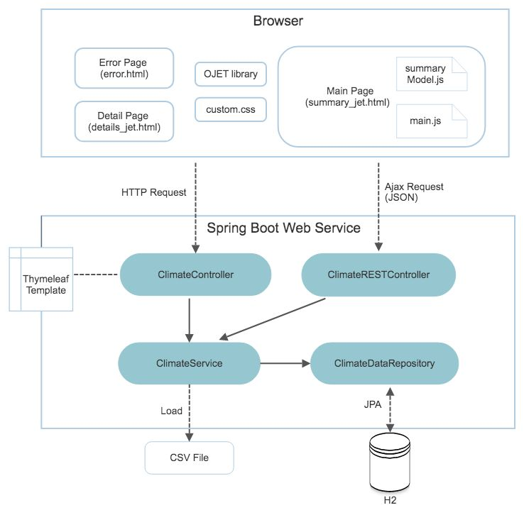

# ClimateTracker
Climate Data Tracking Tool


## Table of Contents
- [Download/Run](#download)
  - [Compile and Run (Windows)](#run-on-windows)
  - [Compile and Run (Mac/Linux)](#run-on-mac)
- [Application Explained](#application)
  - [Main Page](#access-main)
  - [Detail Page](#access-detail)
- [JUnit Test](#download)
  - [Run Testcase (Windows)](#run-test-on-windows)
  - [Run Testcase (Mac/Linux)](#run-test-on-mac)
- [Tools and Technologies Used](#technologies)
  - [Server Side](#server)
  - [Client Side](#client)
  - [JUnit Test](#junit)
- [Design Diagram](#design)


## <a id="download"></a>Download/Run
:tada: :tada: [Download the entire project from Github here](https://github.com/cookieboo119/ClimateTracker/archive/master.zip) :tada: :tada:
Unzip the downloaded file. 

#### <a id="run-on-windows"></a>Run from Windows
If you use Windows and have JAVA_HOME configured, from the unzipped root directory run command:
```bash
mvnw spring-boot:run
```

#### <a id="run-on-mac"></a>Run from mac or linux
If you use mac or linux, unzip master.zip, from the unzipped root directory run command: 
```bash
./mvnw spring-boot:run
```


## <a id="application"></a>Application Explained

#### <a id="access-main"></a>Main Page
Once the application is running, access the main page with following URL: http://localhost:8080/main 

From the main page, you may filter the results by date: toggle search condition and select dates, then click on 'Apply' button. You may click on 'Clear' button to clear the filter. Note that client side validation is applied on the date values selected/entered.

There is a graph on the main page to help visualize the filtered data further by province. You may toggle between different province to view the summary data. 

On the result table, you may sort the data by each of the column. Pagination is enabled, where you can toggle the size of displayed table rows. 


#### <a id="access-detail"></a>Detail Page
You may drill down to the detail page by clicking on the link on the 'Average Temperature' column. From detial page, you may use breadcrumb on top of the page to go back to the main page. 


## <a id="junit"></a>Junit Test

#### <a id="run-test-on-windows"></a>Run Testcase (Windows)
use command: 
```bash
mvnw test
```

#### <a id="run-test-on-mac"></a>Run Testcase (Mac/Linux)
use command: 
```bash
./mvnw test
```

## <a id="technologies"></a>Tools and Technologies Used

#### <a id="server"></a>Server Side
- [x] JDK - 1.8 or later
- [x] Spring Boot - 2.2.2.RELEASE
- [x] Spring Framework - 5.2.2 RELEASE
- [x] Hibernate - 5.4.9
- [x] Thymeleaf - 3.0.11 RELEASE
- [x] H2 - 1.4.2
- [x] Apache commonsCSV - 1.8
- [x] Maven - 4.0.0


#### <a id="client"></a>Client Side
- [x] JQuery
- [x] RequireJS
- [x] Oracle JET - 8.1 Release downloaded from https://www.oracle.com/ca-en/tools/downloads/jet-downloads.html

#### <a id="junit"></a>JUnit Test
- [x] Mockito - 3.1.0
- [x] JUnit Jupiter APIs - 5.5.2 (part of Spring Framework) 


## <a id="design"></a>Design Diagram
Key files and design diagram as following:
 


